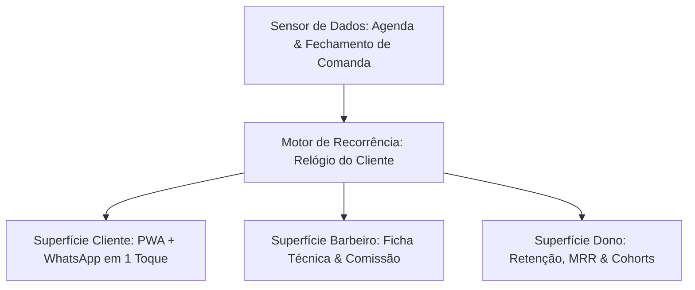

# Especificação do Produto: BarberMe

**BarberMe** é um motor de recorrência e retenção para barbearias. A agenda é tratada como um sensor de dados para alimentar o algoritmo de estimativa do **Relógio do Cliente** e padronizar o atendimento através da **Ficha Técnica do Corte**.

---

## 1. Problem Statement

1. **Cliente:** Dificuldade em explicar o corte ("igual da última vez"), esquecimento do momento ideal de cortar (só percebe quando o cabelo já cresceu demais) e resistência a baixar apps nativos apenas para agendar serviços esporádicos.
2. **Barbeiro:** Renda 100% variável com alta ociosidade nos primeiros dias da semana (terça/quarta), perda financeira direta por faltas (no-show) e falta de controle do seu histórico e comissões.
3. **Dono da Barbearia:** Alta dependência de barbeiros-estrela (risco de perda de carteira em caso de saída), churn invisível de clientes (descobre que o cliente sumiu meses depois) e falta de receita previsível.

---

## 2. A Solução (As Três Camadas)

### O Relógio do Cliente (Motor de Retenção)
Cada cliente possui um intervalo médio histórico ($I_m$) entre cortes (ex: 21 dias). O sistema classifica continuamente o cliente em um dos 5 estados:
- **Em Dia:** $d < I_m - 3$ dias.
- **Na Janela:** $I_m - 3 \le d \le I_m + 3$ dias. *(Gera convite via WhatsApp com horário pré-reservado)*.
- **Em Risco:** $I_m + 3 < d \le I_m + 15$ dias. *(Dispara oferta de Assinatura/Clube)*.
- **Dormente:** $I_m + 15 < d \le I_m + 45$ dias. *(Oferta de reativação / sugestão de troca de barbeiro)*.
- **Perdido (Churn):** $d > I_m + 45$ dias. *(Removido da régua ativa e registrado no relatório de evasão)*.

---

## 3. Histórias de Usuário (User Stories)

### Cliente
1. **Como cliente**, quero receber um aviso no WhatsApp no momento exato em que meu cabelo precisa de corte, para que eu não precise lembrar de agendar.
2. **Como cliente**, quero confirmar um horário sugerido com apenas 1 toque na tela do WhatsApp/PWA, para economizar tempo.
3. **Como cliente**, quero ter uma Ficha Técnica com fotos do meu corte anterior, para que qualquer barbeiro da casa consiga reproduzir exatamente o mesmo estilo.
4. **Como cliente**, quero assinar um plano mensal de cortes para ter prioridade de horários e economizar no valor final sem complicação.

### Barbeiro
5. **Como barbeiro**, quero registrar a Ficha Técnica do corte (fotos + números de máquina) em menos de 20 segundos ao fechar o atendimento.
6. **Como barbeiro**, quero visualizar minha comissão acumulada no dia/mês em tempo real, sem precisar perguntar ao dono.
7. **Como barbeiro**, quero que o sistema preencha meus horários vagos em dias fracos (terça/quarta) convidando clientes que estão na janela exata do relógio.

### Dono da Barbearia
8. **Como dono**, quero acompanhar a taxa de evasão (churn) em tempo real, sabendo exatamente quais clientes estão em risco antes que parem de vir.
9. **Como dono**, quero transformar cortes avulsos em receita recorrente (MRR) via clube de assinaturas.
10. **Como dono**, quero que o histórico dos cortes pertença à barbearia através da Ficha Técnica, reduzindo o risco da perda de clientes se um barbeiro se desligar.

---

## 4. Arquitetura das Superfícies

| Superfície | Tecnologia | Função Principal | Frequência de Uso |
|---|---|---|---|
| **Cliente** | WhatsApp + PWA Web | Confirmar agendamento pré-reservado, ver Ficha Técnica e saldo de assinatura. | 1 a 2 vezes por mês (via notificação). |
| **Barbeiro** | App Nativo Android / PWA Balcão | Registrar Ficha Técnica (20s), acompanhar agenda do dia e comissão. | 15 a 25 vezes por dia. |
| **Dono** | Painel Web Responsive | Monitorar cohort de retenção, receita recorrente (MRR) e comissões gerais. | 2 a 5 vezes por semana. |
| **Motor (Backend)** | Worker de Automação | Calcular Relógio dos clientes, transicionar estados e disparar mensagens. | Execução contínua (Cron / Eventos). |

---

## 5. Algoritmo de Cold Start (Início Frio)

Quando um novo cliente entra na base sem histórico de atendimentos:
1. **Fase 1 (Atendimento 1):** Atribui-se o $I_m$ padrão do serviço prestado (ex: Corte Simples = 21 dias; Barba = 14 dias; Combo = 20 dias).
2. **Fase 2 (Atendimento 2):** Ajusta-se o intervalo ponderando 60% da média da categoria e 40% do primeiro intervalo real observado.
3. **Fase 3 (Atendimento 3 em diante):** O Relógio do Cliente converge 100% para a média móvel ponderada individual.

---

## 6. Estrutura de Dados (Schemas Principais)

### Cliente (`Customer`)
- `id`: UUID
- `name`: String
- `phone`: String (WhatsApp)
- `average_interval_days`: Float (Relógio do Cliente, default=21)
- `status`: Enum (`EM_DIA`, `NA_JANELA`, `EM_RISCO`, `DORMENTE`, `PERDIDO`)
- `last_service_at`: Timestamp
- `preferred_barber_id`: UUID

### Ficha Técnica do Corte (`HaircutSpec`)
- `id`: UUID
- `appointment_id`: UUID
- `customer_id`: UUID
- `barber_id`: UUID
- `photo_before_url`: String
- `photo_after_url`: String
- `guard_numbers`: Json (ex: `{ top: "tesoura", sides: "pente 1.5", fade: "navalhado" }`)
- `products_used`: Array[String]
- `notes`: Text (ex: "Redemoinho na coroa, falha na barba lado esquerdo")
- `created_at`: Timestamp

### Plano de Assinatura (`SubscriptionContract`)
- `id`: UUID
- `customer_id`: UUID
- `plan_name`: String (ex: "Clube da Barba 2x")
- `monthly_price`: Decimal
- `cuts_per_month`: Integer
- `cuts_remaining`: Integer
- `status`: Enum (`ACTIVE`, `PAUSED`, `CANCELLED`)
